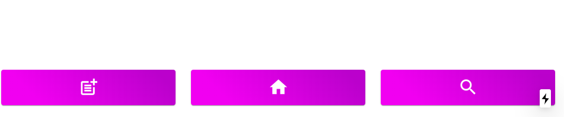
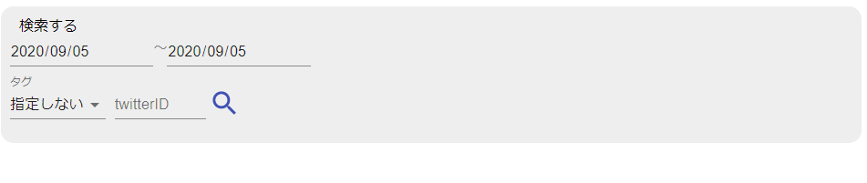
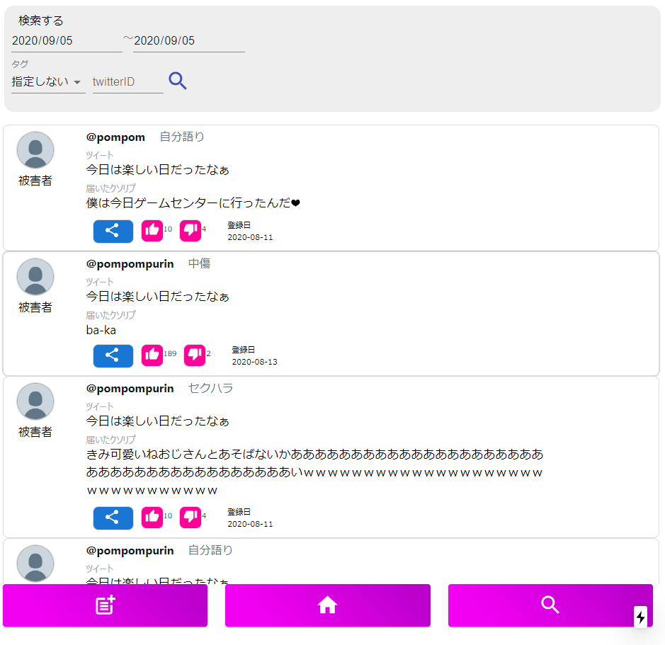
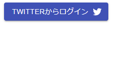

## gomitter(ゴミッター)(製作開始8月6日)

### ゴミッターとは
・自分のツイートについているリプライを選択し、それを登録、その後ツイッターで共有することで自分についてるクソリプを共有できる

### 特徴
登録されたクソリプはサーバーに保存されるので、検索条件(どんなタイプのクソリプだったのか(カテゴリー)、どのユーザーが登録したクソリプなのか(id検索)、登録期間(何月何日から～までなど)を指定して検索できる)面白いクソリプを探し、それをツイートで共有することでツイッターの話題のネタの元になるだろうと考えています。

### 使用技術スタック
- Typescript
- React.js
- Next.js
- Firebase
- Vercel(ホスティング先)
VercelとNext.jsの組み合わせはFirebaseより簡単にホスティングできるためVercelを選択した。

### どのくらいのページを作ろうとしていたか
以下、

### 現在(2020年9月5日現在)の開発状況
- 画面下のmenubarは作成完了(色等の調整は随時行う)

- 検索条件入力画面SearchFieldも完成(色等は上記同様)

- 検索条件を入力したときの結果となるクソリプリストのコンポーネントは完成

(Firestoreからデータを受ける処理は作成中)以下、見込み画像
- Twitterログインボタン、ログアウトボタンは作成完了

- Twitterログインボタンを押したとき、FirebaseのAuth機能でツイッター認証を行う機能完了、その時、OAuth Tokenを受け取り、ログインが完了した瞬間にfetch apiにてネットワーククエストを送信、リクエストを受け取ったサーバー(Vercelのサーバーレス関数(pages/apiディレクトリ)にあるNode.js)にてTwitter apiを利用、認証をした本人のTweetデータを取得するためのHTTPリクエストを贈り、その結果となるJSONファイルを受け取って、そのデータをクライアント側にレスポンスするところまでは完了

### 今後の開発
- HOME画面の作成(使い方の説明等をそれぞれのページごとに作成していく)
- 受け取ったTwitter apiのJSONファイルをもとにしたオリジナルのツイートリストのコンポーネント作成
- 自分のツイートを選択したときにそのツイートのリプライ飲みを表示できるようにすること(公式のTwitter api　では特定のツイートのリプライを取得する apiは発行されていないのでJSONファイルをうまくfilterしていく予定)
- 検索結果に表示されているクソリプリストには本サービス独自のlikeボタンとdislikeボタンがあるがそれぞれのボタンを押したときにファボした情報をfirebaseに送信する処理
- Twitter利用規約,etc...
### 改善点
- Next.jsのcssの取り扱い方がわからず、コンポーネントファイルに直接css in jsとして記入したり、グローバルモジュールとして_app.jsに記入したり、ローカルモジュールとして記入したりと混在しているところ(現在はローカルモジュール形式として修正中)
※修正完了

- コードが汚いこと(どのような方法で書くのがベストなのかわからず手探りで書いたため)

- テストコードの書き方を勉強するのを怠り、デバッグをすべてconsole.logで行っているところ

